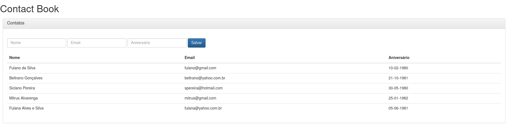

## Sobre
Projeto Spring Boot e Thymeleaf para cadastrar contatos.

## Requisitos
* JDK 17
* Maven 3.8.x
* MySQL 8.x.x

## Preparando o projeto
1. Criar o banco de dados
```
CREATE DATABASE contactbook;

USE contactbook;

CREATE TABLE contacts (
  id INTEGER NOT NULL AUTO_INCREMENT,
  name VARCHAR(80) NOT NULL,
  email VARCHAR(80) NOT NULL,
  birthday DATE NOT NULL,
  PRIMARY KEY (id)
);
```

2. Clonar a aplicação
```
git clone https://github.com/erosvitor/template-springboot-thymeleaf.git
```

3. Construir o projeto
```
mvn package
```

4. Executar o projeto
```
java -jar target/template-springboot-thymeleaf-1.0.0.jar
```

5. Acessar o projeto
```
http://localhost:8080/contacts
```

## Screenshot


## Licença
Este projeto está sob licença do MIT. Para mais detalhes, ver o arquivo LICENSE.
